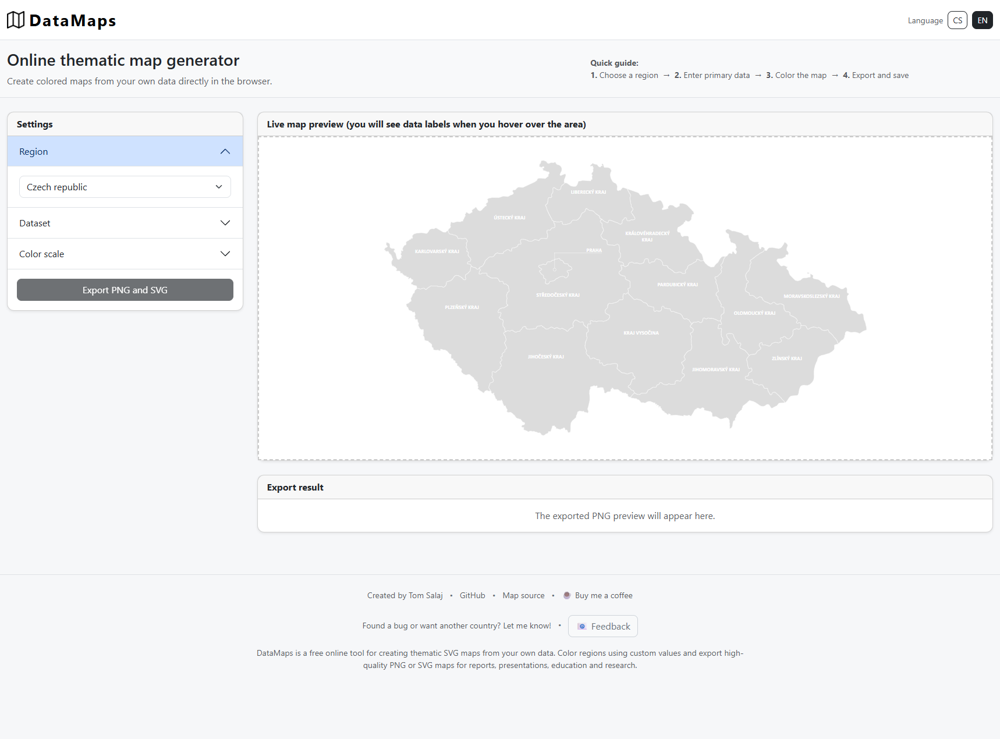
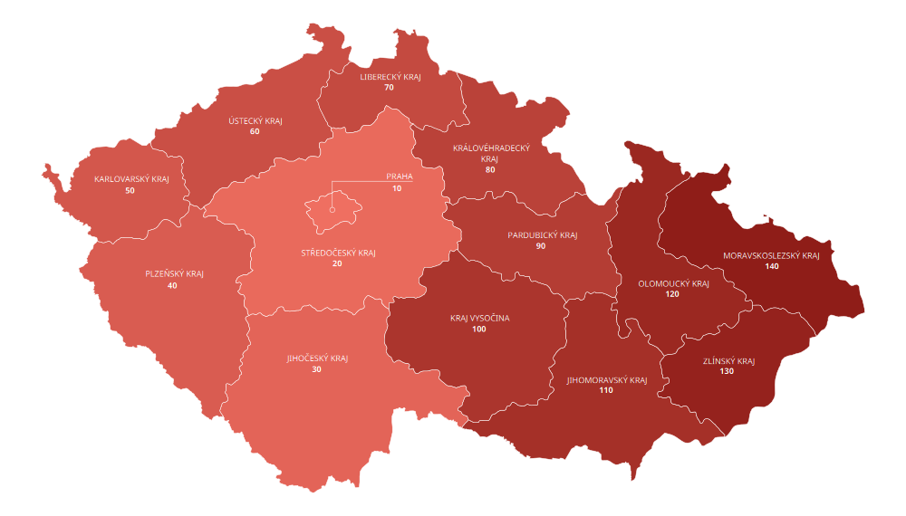
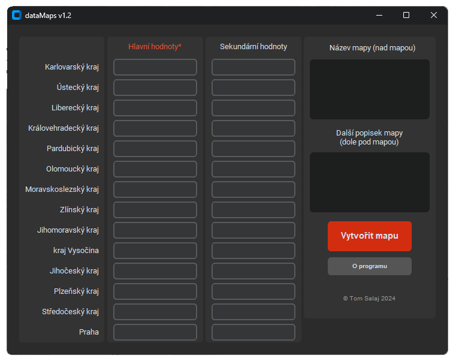
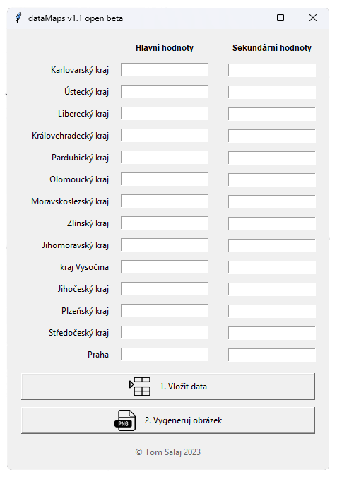

# 🌍 DataMaps

Free online thematic map generator.

[DataMaps.cz/en](https://datamaps.cz/en)

Create professional SVG and PNG maps from regional data using customizable color scales. Designed for reports, presentations, education, and research.

---

## 🕒 Project history

### July 2026 – Web version 1.0

Complete redesign of the project.

- Python + Flask
- Interactive SVG maps
- Live preview
- SVG & PNG export
- Export result links can be sent by e-mail
- Delete link for removing exported PNG and SVG results
- Multiple color scales
- Supported countries: Czechia, Slovakia, Poland
- Language versions: Czech, Polish, English
- Responsive web interface

### Example output

---

### 2024 – Desktop version 1.2

Improved desktop application.

- Python
- CustomTkinter GUI
- Improved user interface
- Better error handling
- Various usability improvements

---

### 2023 – Desktop version 1.1

The first prototype of DataMaps.

- Python
- Tkinter GUI
- PNG layer composition
- Experimental version

The application generated thematic maps by stacking multiple PNG layers into a final colored map.

---

## ✨ Design philosophy

DataMaps focuses on simplicity.

The goal is to create a professional thematic map in just a few steps:

1. Choose a region
2. Enter your data
3. Select a color scale
4. Export the finished map

No registration.
No unnecessary configuration.
No complicated interface.

---

## 🛠 Technologies

- Python
- Flask
- JavaScript
- Bootstrap
- SVG
- SQLite

---

## 🚧 Current status

Active development

The source code is currently private while the project is under active development.

---

## 🚀 Final Words

**Learn, code, enjoy — good luck!**  
*Tom Salaj*

